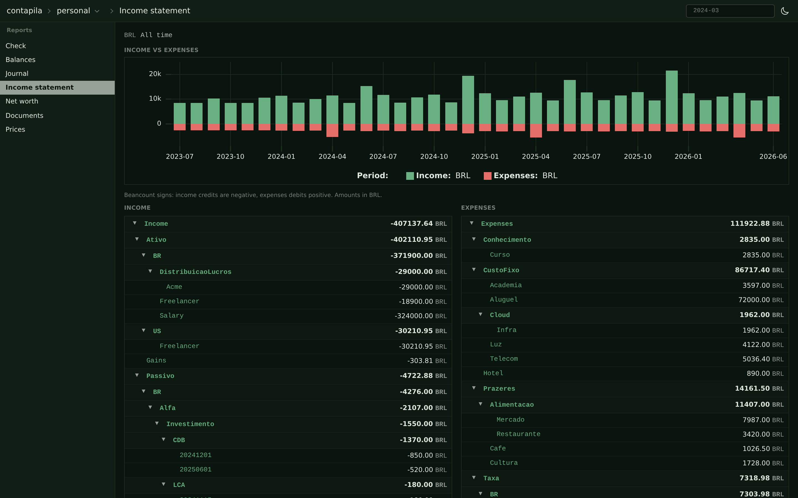
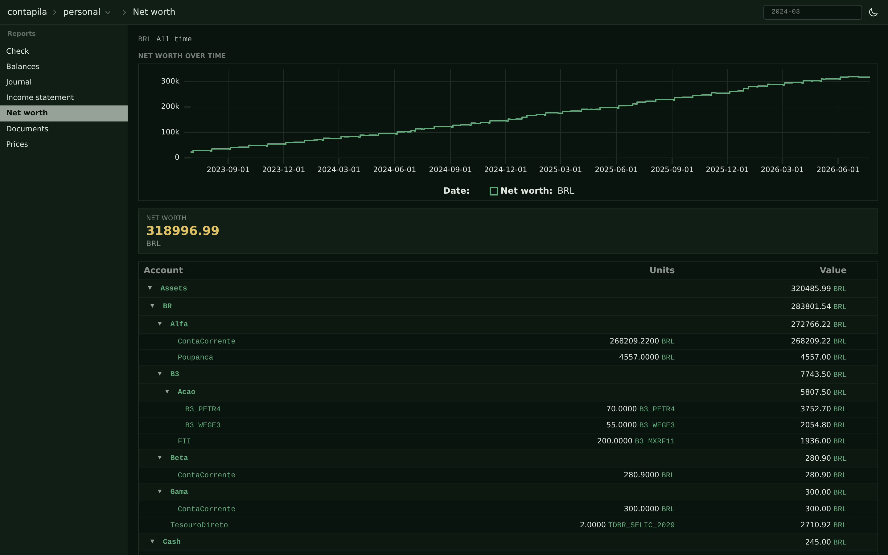

# Contapila

Beancount-class double-entry engine and read-only web UI in one Go binary.

You keep journals in plain text. Contapila loads a multi-ledger project, runs `check`, and answers balances / journal / P&L / net worth from the CLI or a localhost UI. No Python Beancount runtime, no plugin system.

**Status:** MVP. Language and booking contract: [`SPEC.md`](SPEC.md). Product notes: [`PRODUCT.md`](PRODUCT.md). Web UI notes: [`DESIGN.md`](DESIGN.md).

## Install

### Binary

Download a release from [GitHub Releases](https://github.com/lewtec/contapila/releases) (linux/darwin, amd64/arm64), unpack, put `contapila` on your `PATH`.

```bash
# example: Linux x86_64, version 0.0.4
curl -fsSL -o contapila.tgz \
  https://github.com/lewtec/contapila/releases/download/0.0.4/contapila_Linux_x86_64.tar.gz
tar -xzf contapila.tgz
sudo install -m 755 contapila /usr/local/bin/contapila
contapila --version
```

### mise

```bash
mise use -g github:lewtec/contapila
# or: mise install github:lewtec/contapila
```

Otherwise use the binary above, or `go install` under [Development](#development).

## Try the example

Clone this repo (or copy [`testdata/example`](testdata/example)). The fixture is a multi-ledger project: personal books, a company ledger, grants, inventory — with shared prices and a CDI index series.

```bash
# from the repo root
contapila -C testdata/example status
contapila -C testdata/example check
contapila -C testdata/example networth personal
contapila -C testdata/example pnl personal
contapila -C testdata/example web
```

`-C` / `--directory` is like `git -C`: run as if the process started in that directory. Project root is the directory that contains `contapila.cue`.

`check` validates every ledger. Unsupported constructs (for example `query`) warn and skip when safe:

```text
== acme ==
…/acme/surface.beancount:5: warn: query not supported; skipped
OK
== ong ==
OK
== personal ==
…/personal/surface.beancount:9: warn: query not supported; skipped
OK
== smuggle ==
OK
```

`networth personal` prices inventory into the operating currency (here BRL):

```text
== personal net worth (BRL) ==
Σ Assets                                        => 320485.99 BRL
  Σ BR                                            => 283801.54 BRL
    Σ Alfa                                          => 272766.22 BRL
        ContaCorrente                 268209.2200 BRL => 268209.22 BRL
    Σ B3                                            => 7743.50 BRL
      Σ Acao                                          => 5807.50 BRL
          B3_PETR4                     70.0000 B3_PETR4 => 3752.70 BRL
…
```

`web` serves the same numbers in the browser (default `http://127.0.0.1:8765/`). Open **Income statement** and **Net worth** on the `personal` ledger:





Optional: refresh the shared CDI index from the BCB series and merge it with `ingest` (idempotent by `ingest_id`):

```bash
./scripts/fetch-cdi --from 2023-09-01 --to 2025-06-30 \
  | contapila ingest --file testdata/example/indexes.beancount
```

What the example exercises is listed in [`testdata/README.md`](testdata/README.md). For a huge volume corpus (not a tutorial), see `testdata/kitchensink/`.

## Mental model

After you have run the commands above, this is what you were looking at.

**Project.** A directory with `contapila.cue` plus one subdirectory per ledger. Ledgers are discovered as `*/main.beancount` (names are the directory names: `personal`, `acme`, …). Root files such as `prices.beancount` and `indexes.beancount` can be auto-loaded into every ledger (see the prelude / SPEC).

**Journal.** Beancount-style plain text: opens, postings, prices, pads, balances, closes, metadata. Contapila implements a **plugin-free subset**. Unknown or unsupported constructs either warn+skip or error if continuing would lie about balances. Full contract: [`SPEC.md`](SPEC.md).

**Booking.** Default inventory is **merged average-cost**. That matches common “preço médio” use and **can disagree** with upstream Beancount on files that never set a booking method. Documented product policy, not a silent bug (SPEC §2.2).

**Reports.** CLI and web share the same engine: check, balances, journal, P&L, net worth, account views. Web is **read-only** (no in-browser edit). `desktop` opens the same UI in an eletrocromo/Helium window when available. `lsp` speaks language-server protocol for editors (Helix dogfood).

**ingest.** Merge JSONL directives into a `.beancount` file (upsert by `id` → `ingest_id`). Useful for price/index pipelines such as `scripts/fetch-cdi`.

**dump.** Walk PDF/XLSX element trees to compact JSON for stdlib extract scripts (`contapila dump …`, optional `--password` for encrypted files).

## Compared to Beancount and Fava

Contapila took poetic license on tooling so the stack stays small: one binary, fixed defaults, no plugin host.

| | Contapila | Beancount + Fava (typical) |
|--|-----------|----------------------------|
| Runtime | Single Go binary | Python + bean-\* tools + Fava |
| Plugins | None | Central to the ecosystem |
| UI | Read-only localhost web (or desktop shell) | Fava (browse + more) |
| Language | Plugin-free Beancount-class subset | Full Beancount + plugins |
| Booking default | Merged average-cost | Lot-centric unless configured |
| Query language | No BQL parity (MVP) | bean-query / BQL |
| Config | CUE project (`contapila.cue`) | options / Fava config |
| Editor | Optional `contapila lsp` | Various community options |

**MVP non-goals** (also in SPEC): Python plugin compatibility, full BQL, Fava-style write-back, multi-user remote hosting, flag-compatible bean-\* CLIs.

## CLI

| Command | Purpose |
|---------|---------|
| `status` | Project / ledger discovery |
| `check [ledger]` | Validate (all ledgers if omitted) |
| `balances [ledger]` | Balances as-of |
| `journal [ledger]` | Period activity |
| `pnl [ledger]` | Income vs expenses |
| `networth [ledger]` | Net worth as-of |
| `account …` | Account-focused views |
| `parse` | Parse diagnostics for a file |
| `ingest --file path [-- CMD …]` | JSONL → beancount merge |
| `dump <dialect> <path>` | PDF/XLSX element tree → compact JSON (`--password` for encrypted files) |
| `web [ledger]` | Read-only HTTP UI |
| `desktop [ledger]` | Same UI via eletrocromo |
| `lsp` | Language server (stdio) |

Ledger arguments are **directory names** under the project root.

## Development

Standard Go module (`github.com/lucasew/contapila-go`). Go version is pinned in [`mise.toml`](mise.toml) if you use mise for the toolchain; Bun is only for CSS codegen.

```bash
go test ./...
go build -o contapila ./cmd/contapila/

# optional: mise-managed toolchain + CI-shaped checks
mise run install    # go mod tidy + bun install
mise run codegen    # rebuild embedded web CSS
mise run ci         # codegen + tests + build
```

```bash
go install github.com/lucasew/contapila-go/cmd/contapila@latest
```

## Docs map

| Doc | Role |
|-----|------|
| [`SPEC.md`](SPEC.md) | Language, project layout, booking, reports, LSP |
| [`PRODUCT.md`](PRODUCT.md) | Users, personality, design principles |
| [`DESIGN.md`](DESIGN.md) | Web UI density, theme, charts |
| [`testdata/README.md`](testdata/README.md) | Example and kitchensink fixtures |

## License

No `LICENSE` file is in the tree yet. Treat the project as the author’s defaults until one is added.
